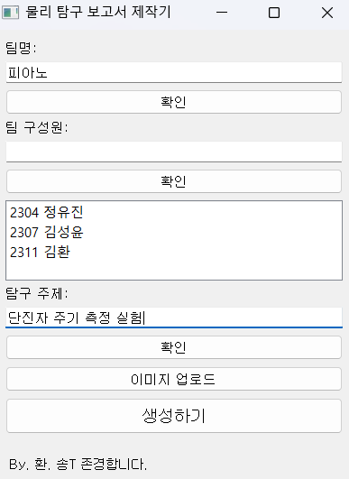

# 물주탐 보고서 생성기
이미지와 탐구 주제만으로 3페이지 분량의 보고서를 작성합니다.
hwpapi, gpt-4o 모델 활용
## How to use:

#### 1. 다운로드 및 환경 설정
```python
git clone https://github.com/hwan809/automated_physics.git
cd automated_physics
pip install -r requirements.txt
```

#### 2. 파일 실행
```python
python main.py
```

#### 3. 프로그램 구동 후, output 폴더에 저장된 보고서 확인

## Showcase:

## More:
> Environments: Windows, Hangul 2022